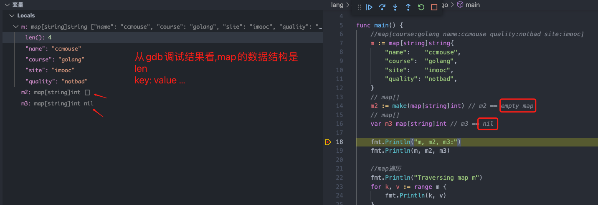

# Map 
## 数据结构
[参考文章](https://draveness.me/golang/docs/part2-foundation/ch03-datastructure/golang-hashmap/)  
      


### gdb 查看map数据结构 
  

### 源码查看map数据结构
[源码](https://github.com/golang/go/blob/master/src/runtime/map.go) 路径: src/runtime/map.go  

```
// This file contains the implementation of Go's map type.
//
// A map is just a hash table. The data is arranged
// into an array of buckets. Each bucket contains up to
// 8 key/elem pairs. The low-order bits of the hash are
// used to select a bucket. Each bucket contains a few
// high-order bits of each hash to distinguish the entries
// within a single bucket.
//
// If more than 8 keys hash to a bucket, we chain on
// extra buckets.
//
// When the hashtable grows, we allocate a new array
// of buckets twice as big. Buckets are incrementally
// copied from the old bucket array to the new bucket array.
//
// Map iterators walk through the array of buckets and
// return the keys in walk order (bucket #, then overflow
// chain order, then bucket index).  To maintain iteration
// semantics, we never move keys within their bucket (if
// we did, keys might be returned 0 or 2 times).  When
// growing the table, iterators remain iterating through the
// old table and must check the new table if the bucket
// they are iterating through has been moved ("evacuated")
// to the new table.
```  

### 通过debug源码查看map结构  

```
package main

func main() {
	name2Everything := make(map[string]interface{})
	name2Everything["xiaoming"] = "100"
	name2Everything["age"] = "200"
	name2Everything["1"] = 1
	name2Everything["2"] = 2
	name2Everything["3"] = 3
	name2Everything["4"] = 4
	name2Everything["5"] = 5
	name2Everything["6"] = 6
	name2Everything["7"] = 7
	name2Everything["8"] = 8
}
```

断点加在go1.16.9源码的src/runtime/map.go:293 `makemap_small() *hmap`方法上  
查看编译器参数已经禁止编译器优化: `go build -o go_build_map_struct_go -gcflags "all=-N -l"ap_struct.go #gosetup`  

make创建map调用的代码是:  
```
// makemap_small implements Go map creation for make(map[k]v) and
// make(map[k]v, hint) when hint is known to be at most bucketCnt
// at compile time and the map needs to be allocated on the heap.
func makemap_small() *hmap {
	h := new(hmap)
	h.hash0 = fastrand()
	return h
}
```  
[make与new的区别](https://draveness.me/golang/docs/part2-foundation/ch05-keyword/golang-make-and-new/)  

其中需要注意buckets 是一个指针，最终它指向的是一个结构体：
```
type bmap struct {
    tophash [bucketCnt]uint8
}
```
但这只是表面的结构，编译期间会给它加料，动态地创建一个新的结构：
go1.16.9/src/cmd/compile/internal/gc/reflect.go:83 
[golang 哈希表网文](https://draveness.me/golang/docs/part2-foundation/ch03-datastructure/golang-hashmap/)  

```
// bmap makes the map bucket type given the type of the map.
func bmap(t *types.Type) *types.Type {
	if t.MapType().Bucket != nil {
		return t.MapType().Bucket
	}

	bucket := types.New(TSTRUCT)
	keytype := t.Key()
	elemtype := t.Elem()
	dowidth(keytype)
	dowidth(elemtype)
	if keytype.Width > MAXKEYSIZE {
		keytype = types.NewPtr(keytype)
	}
	if elemtype.Width > MAXELEMSIZE {
		elemtype = types.NewPtr(elemtype)
	}
...
```


  
```
type bmap struct {
    topbits  [8]uint8
    keys     [8]keytype
    values   [8]valuetype
    pad      uintptr
    overflow uintptr
}
```
bmap 就是我们常说的“桶”，桶里面会最多装 8 个 key，这些 key 之所以会落入同一个桶，是因为它们经过哈希计算后，哈希结果是“一类”的。在桶内，又会根据 key 计算出来的 hash 值的高 8 位来决定 key 到底落入桶内的哪个位置（一个桶内最多有8个位置）。  

[断点调试map的编译过程](https://github.com/ymm135/golang-cookbook/blob/master/md/base/source/debug.md) ，首先看下调用栈:  
```
cmd_local/compile/internal/gc.bmap at reflect.go:90
cmd_local/compile/internal/gc.hmap at reflect.go:199
cmd_local/compile/internal/gc.walkexpr at walk.go:1207
cmd_local/compile/internal/gc.walkexpr at walk.go:626
cmd_local/compile/internal/gc.litas at sinit.go:385
cmd_local/compile/internal/gc.maplit at sinit.go:758
cmd_local/compile/internal/gc.anylit at sinit.go:949
cmd_local/compile/internal/gc.oaslit at sinit.go:981
cmd_local/compile/internal/gc.walkexpr at walk.go:611
cmd_local/compile/internal/gc.walkstmt at walk.go:149
cmd_local/compile/internal/gc.walkstmtlist at walk.go:81
cmd_local/compile/internal/gc.walk at walk.go:65
cmd_local/compile/internal/gc.compile at pgen.go:239
cmd_local/compile/internal/gc.funccompile at pgen.go:220
cmd_local/compile/internal/gc.Main at main.go:762
main.main at main.go:52
runtime.main at proc.go:225
runtime.goexit at asm_amd64.s:1371
 - Async stack trace
runtime.rt0_go at asm_amd64.s:226
```
 
 
 
  
## Hash函数    

## 通过IDEA调试map源码
如果想要连接map编译过程，可以使用编译器断点调试go compile源码。[断点调试源码教程](https://github.com/ymm135/golang-cookbook/blob/master/md/base/source/debug.md)   
 

