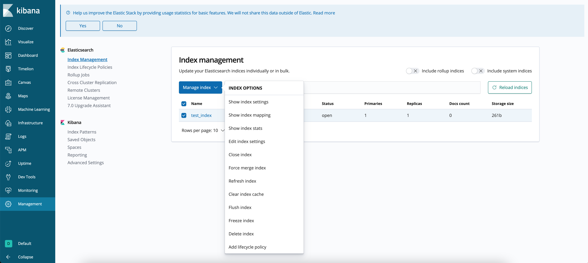

# ES基础
## docker搭建es 6.8

```
# 拉取镜像
docker pull docker.elastic.co/elasticsearch/elasticsearch:6.8.20

# 运行镜像
docker run -d --name elasticsearch -p 9200:9200 -p 9300:9300 -e "discovery.type=single-node" docker.elastic.co/elasticsearch/elasticsearch:6.8.20
```

访问`http://localhost:9200/`
```
{
  "name" : "cefBBBH",
  "cluster_name" : "docker-cluster",
  "cluster_uuid" : "UsdiqEMZSNO-AqsOBtxF_Q",
  "version" : {
    "number" : "6.8.20",
    "build_flavor" : "default",
    "build_type" : "docker",
    "build_hash" : "c859302",
    "build_date" : "2021-10-07T22:00:24.085009Z",
    "build_snapshot" : false,
    "lucene_version" : "7.7.3",
    "minimum_wire_compatibility_version" : "5.6.0",
    "minimum_index_compatibility_version" : "5.0.0"
  },
  "tagline" : "You Know, for Search"
}
```

## 使用elasticsearch head插件

### 查看节点信息
  

### 索引

## 使用kibana  
### 安装 

```
# 拉取镜像
docker pull docker.elastic.co/kibana/kibana:6.8.20

# 启动并绑定es (--link elasticsearch 是容器名)
docker run -d --name kibana --link elasticsearch -p 5601:5601  docker.elastic.co/kibana/kibana:6.8.20
```

访问页面`http://localhost:5601/` , 访问manager，可以查看索引及端口 

  


