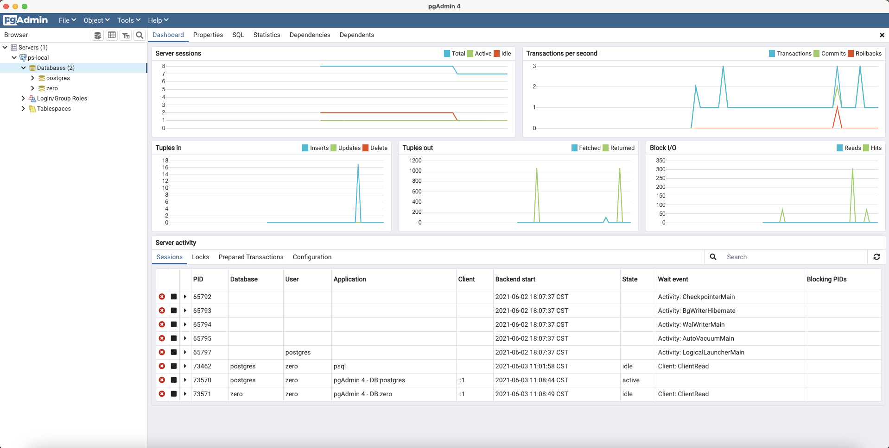

# pgsql 基础

## [官网](https://www.postgresql.org/)  
[postgres11文档](https://www.postgresql.org/docs/11/index.html)  

## docker install  
[镜像文档](https://hub.docker.com/_/postgres)  

```shell
docker run -d -p 5432:5432 --name postgres -e POSTGRES_PASSWORD=root  postgres:11.12   
```

> 默认数据库postgres, 默认用户postgres, 默认端口5432  

docker-compose.yml 示例
```yaml
# Use postgres/example user/password credentials
version: '3.1'

services:
  db:
    image: postgres:11.12
    # restart: always
    environment:
      POSTGRES_PASSWORD: root
    ports:
      - 5432:5432

  adminer:
    image: adminer
    # restart: always
    ports:
      - 8980:8080
```  

测试启动`docker-compose up` 或者后台运行`docker-compose up -d` 
访问`http://localhost:8980/`  登录pgsql  

  
<br>


<br>


<br> 

## [pgAdmin工具](https://www.postgresql.org/download/)  


  

> 需要设置密码: set master password ,不然连接时会有

## 常用指令  

命令行进入:  
```shell
$ psql mydb

psql (11.14)
Type "help" for help.

mydb=>

mydb=> SELECT version();
                                         version
------------------------------------------------------------------------------------------
 PostgreSQL 11.14 on x86_64-pc-linux-gnu, compiled by gcc (Debian 4.9.2-10) 4.9.2, 64-bit
(1 row)
```

```shell
\h：查看SQL命令的解释，比如\h select。
?：查看psql命令列表。
\l：列出所有数据库。
\c [database_name]：连接其他数据库。
\d：列出当前数据库的所有表格。
\d [table_name]：列出某一张表格的结构。
\du：列出所有用户。
\e：打开文本编辑器。
\conninfo：列出当前数据库和连接的信息。

```  

## [pipeline安装及使用](http://docs.pipelinedb.com/quickstart.html)

[pipeline安装](http://docs.pipelinedb.com/installation.html)  


