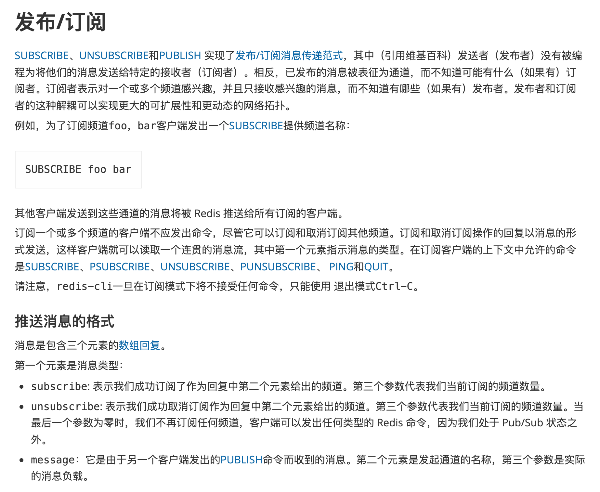

# redis基础
## [官网](https://redis.io/)  
### [在线redis](https://try.redis.io/)  
### [所有指令](https://redis.io/commands)  

## docker 安装

```
docker run -p 6379:6379 --name redis -d redis:5.0 --requirepass 'redis'

> config set requirepass redis
```

## 容器
### [list](https://redis.io/commands#list)  
```
127.0.0.1:6379> LPUSH mylist "world"
(integer) 1
127.0.0.1:6379> LPUSH mylist "hello"
(integer) 2
127.0.0.1:6379> LRANGE mylist 0 -1
1) "hello"
2) "world"
127.0.0.1:6379> LPOP mylist
"hello"
127.0.0.1:6379> RPUSH mylist "one"
(integer) 2
127.0.0.1:6379> RPUSH mylist "two"
(integer) 3
127.0.0.1:6379> 
```

### [hash](https://redis.io/commands#hash)  

```
127.0.0.1:6379> HMSET myhash field1 "Hello" field2 "World"
OK
127.0.0.1:6379> HGET myhash field1
"Hello"
127.0.0.1:6379> HKEYS myhash
1) "field1"
2) "field2"
127.0.0.1:6379> HVALS myhash
1) "Hello"
2) "World"
127.0.0.1:6379> HLEN myhash
(integer) 2
```

### [sets](https://redis.io/commands#set)  

```
127.0.0.1:6379> SADD myset "one"
(integer) 1
127.0.0.1:6379> SADD myset "two"
(integer) 1
127.0.0.1:6379> SADD myset "three"
(integer) 1
127.0.0.1:6379> SPOP myset
"two"
127.0.0.1:6379> SMEMBERS myset
1) "three"
2) "one"
127.0.0.1:6379> SADD myotherset "three"
(integer) 1
127.0.0.1:6379> SADD myset "two"
(integer) 1
127.0.0.1:6379> SMEMBERS myset
1) "two"
2) "three"
3) "one"
127.0.0.1:6379> SMOVE myset myotherset "two"
(integer) 1
127.0.0.1:6379> SMEMBERS myset
1) "three"
2) "one"
```


## [pipeline](https://redis.io/topics/pipelining)  


## [Redis Pub/Sub](https://redis.io/topics/pubsub)  
  

- 订阅的不是字段/key, 而是channel

```
SUBSCRIBE foo bar [channel ...]
```

- 如果没有订阅，发布消息到channel会失败
```
127.0.0.1:6379> PUBLISH foo redis
(integer) 1
127.0.0.1:6379> PUBLISH foo 2
(integer) 1
127.0.0.1:6379> PUBLISH foo 2
(integer) 0
127.0.0.1:6379> PUBLISH foo 3       //执行 SUBSCRIBE foo 
(integer) 0
127.0.0.1:6379> PUBLISH foo 3
(integer) 1
127.0.0.1:6379> 
```

## [Using Redis as an LRU cache](https://redis.io/topics/lru-cache)  
在Redis的配置文件redis.conf文件中，配置maxmemory的大小参数如下所示：
```
maxmemory 100mb
```

命令行设置
```
127.0.0.1:6379> config get maxmemory
1) "maxmemory"
2) "0"
127.0.0.1:6379> config set maxmemory 100mb
OK
127.0.0.1:6379> config get maxmemory
1) "maxmemory"
2) "104857600"
```  

倘若实际的存储中超出了Redis的配置参数的大小时，Redis中有淘汰策略，把需要淘汰的key给淘汰掉，整理出干净的一块内存给新的key值使用。  

Redis提供了6种的淘汰策略，其中默认的是noeviction，这6中淘汰策略如下：

- noeviction(默认策略)：若是内存的大小达到阀值的时候，所有申请内存的**指令都会报错**。
- allkeys-lru：所有key都是使用LRU算法进行淘汰。
- volatile-lru：所有设置了过期时间的key使用LRU算法进行淘汰。
- allkeys-random：所有的key使用随机淘汰的方式进行淘汰。
- volatile-random：所有设置了过期时间的key使用随机淘汰的方式进行淘汰。
- volatile-ttl：所有设置了过期时间的key根据过期时间进行淘汰，越早过期就越快被淘汰。

假如在Redis中的数据有一部分是热点数据，而剩下的数据是冷门数据，或者我们不太清楚我们应用的缓存访问分布状况，这时可以使用allkeys-lru。  

假如所有的数据访问的频率大概一样，就可以使用allkeys-random的淘汰策略。  

假如要配置具体的淘汰策略，可以在redis.conf配置文件中配置，具体配置如下所示：  
```
maxmemory-policy noeviction
```

命令行设置:
```
127.0.0.1:6379> config get maxmemory-policy
1) "maxmemory-policy"
2) "noeviction"
127.0.0.1:6379> config set maxmemory-policy allkeys-lru
OK
127.0.0.1:6379> config get maxmemory-policy
1) "maxmemory-policy"
2) "allkeys-lru"
```


