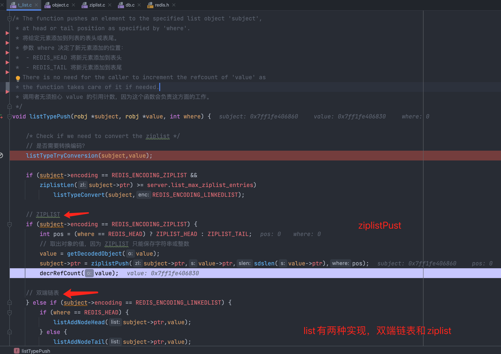

# redis 数据结构
## [调试redis 3.0源码](https://github.com/ymm135/redis-3.0-annotated)  

```
src/t_hash.c    # hash
src/t_list.c    # list
src/t_set.c     # set
src/t_string.c  # string 
src/t_zset.c    # zset ZSET 同时使用两种数据结构来持有同一个元素，从而提供 O(log(N)) 复杂度的有序数据结构的插入和移除操作。
```


## [ziplist数据结构](https://mp.weixin.qq.com/s?__biz=MzI2MDQzMTU2MA==&mid=2247484130&idx=1&sn=f9677e06b5fccfd0696a68c431b3f013&chksm=ea688945dd1f00533ef41bfc97041704a7d2a4318ffa4387a03f4b52e9d959ed005ab930599f&token=1987875319&lang=zh_CN#rd)      

```
非空 ziplist 示例图

area        |<---- ziplist header ---->|<----------- entries ------------->|<-end->|

size          4 bytes  4 bytes  2 bytes    ?        ?        ?        ?     1 byte
            +---------+--------+-------+--------+--------+--------+--------+-------+
component   | zlbytes | zltail | zllen | entry1 | entry2 |  ...   | entryN | zlend |
            +---------+--------+-------+--------+--------+--------+--------+-------+
                                       ^                          ^        ^
address                                |                          |        |
                                ZIPLIST_ENTRY_HEAD                |   ZIPLIST_ENTRY_END
                                                                  |
                                                        ZIPLIST_ENTRY_TAIL
```

通过clion断点调试:  

  

增加列表时往头部存储。
```
# src/redis.h
/* List related stuff */
#define REDIS_HEAD 0
#define REDIS_TAIL 1
```  

列表的创建:  
```
/*
 * 创建一个 ZIPLIST 编码的列表对象
 */
robj *createZiplistObject(void) {

    unsigned char *zl = ziplistNew();
    robj *o = createObject(REDIS_LIST,zl);
    o->encoding = REDIS_ENCODING_ZIPLIST;

    return o;
}
```  

`src/ziplist.c`中的 `ziplistNew()`  
```
/* Create a new empty ziplist. 
 *
 * 创建并返回一个新的 ziplist 
 *
 * T = O(1)
 */
unsigned char *ziplistNew(void) {

    // ZIPLIST_HEADER_SIZE 是 ziplist 表头的大小
    // 1 字节是表末端 ZIP_END 的大小
    unsigned int bytes = ZIPLIST_HEADER_SIZE+1;

    // 为表头和表末端分配空间
    unsigned char *zl = zmalloc(bytes);

    // 初始化表属性
    ZIPLIST_BYTES(zl) = intrev32ifbe(bytes);
    ZIPLIST_TAIL_OFFSET(zl) = intrev32ifbe(ZIPLIST_HEADER_SIZE);
    ZIPLIST_LENGTH(zl) = 0;

    // 设置表末端
    zl[bytes-1] = ZIP_END;

    return zl;
}
```  

// 将值推入到列表，`lobj`就是ziplist对象     
`listTypePush(lobj,c->argv[j],where);`  

  

列表的插入调用的是`ziplistPush`  
```
/*
 * 将长度为 slen 的字符串 s 推入到 zl 中。
 *
 * where 参数的值决定了推入的方向：
 * - 值为 ZIPLIST_HEAD 时，将新值推入到表头。
 * - 否则，将新值推入到表末端。
 * 函数的返回值为添加新值后的 ziplist 。
 *
 * T = O(N^2)
 */
unsigned char *ziplistPush(unsigned char *zl, unsigned char *s, unsigned int slen, int where) {

    // 根据 where 参数的值，决定将值推入到表头还是表尾
    unsigned char *p;
    p = (where == ZIPLIST_HEAD) ? ZIPLIST_ENTRY_HEAD(zl) : ZIPLIST_ENTRY_END(zl);

    // 返回添加新值后的 ziplist
    // T = O(N^2)
    return __ziplistInsert(zl,p,s,slen);
}
```

ziplist的数据结构  

```
/* 
空白 ziplist 示例图

area        |<---- ziplist header ---->|<-- end -->|

size          4 bytes   4 bytes 2 bytes  1 byte
            +---------+--------+-------+-----------+
component   | zlbytes | zltail | zllen | zlend     |
            |         |        |       |           |
value       |  1011   |  1010  |   0   | 1111 1111 |
            +---------+--------+-------+-----------+
                                       ^
                                       |
                               ZIPLIST_ENTRY_HEAD
                                       &
address                        ZIPLIST_ENTRY_TAIL
                                       &
                               ZIPLIST_ENTRY_END

非空 ziplist 示例图

area        |<---- ziplist header ---->|<----------- entries ------------->|<-end->|

size          4 bytes  4 bytes  2 bytes    ?        ?        ?        ?     1 byte
            +---------+--------+-------+--------+--------+--------+--------+-------+
component   | zlbytes | zltail | zllen | entry1 | entry2 |  ...   | entryN | zlend |
            +---------+--------+-------+--------+--------+--------+--------+-------+
                                       ^                          ^        ^
address                                |                          |        |
                                ZIPLIST_ENTRY_HEAD                |   ZIPLIST_ENTRY_END
                                                                  |
                                                        ZIPLIST_ENTRY_TAIL
*/
```

`src/ziplist.c`说明:  
```
/* The ziplist is a specially encoded dually linked list that is designed
 * to be very memory efficient. 
 *
 * Ziplist 是为了尽可能地节约内存而设计的特殊编码双端链表。
 *
 * It stores both strings and integer values,
 * where integers are encoded as actual integers instead of a series of
 * characters. 
 *
 * Ziplist 可以储存字符串值和整数值，
 * 其中，整数值被保存为实际的整数，而不是字符数组。
 *
 * It allows push and pop operations on either side of the list
 * in O(1) time. However, because every operation requires a reallocation of
 * the memory used by the ziplist, the actual complexity is related to the
 * amount of memory used by the ziplist.
 *
 * Ziplist 允许在列表的两端进行 O(1) 复杂度的 push 和 pop 操作。
 * 但是，因为这些操作都需要对整个 ziplist 进行内存重分配，
 * 所以实际的复杂度和 ziplist 占用的内存大小有关。
 *
 * ----------------------------------------------------------------------------
```  

## [hash](https://redis.io/commands#hash)  
```
127.0.0.1:6379> HMSET myhash field3 "redis"
OK
```
插入过程理解:  
  

```
/* Add an element, discard the old if the key already exists.
 * Return 0 on insert and 1 on update.
 *
 * 将给定的 field-value 对添加到 hash 中，
 * 如果 field 已经存在，那么删除旧的值，并关联新值。
 *
 * This function will take care of incrementing the reference count of the
 * retained fields and value objects. 
 *
 * 这个函数负责对 field 和 value 参数进行引用计数自增。
 *
 * 返回 0 表示元素已经存在，这次函数调用执行的是更新操作。
 *
 * 返回 1 则表示函数执行的是新添加操作。
 */
int hashTypeSet(robj *o, robj *field, robj *value) {
    int update = 0;

    // 添加到 ziplist
    if (o->encoding == REDIS_ENCODING_ZIPLIST) {
        unsigned char *zl, *fptr, *vptr;

        // 解码成字符串或者数字
        field = getDecodedObject(field);
        value = getDecodedObject(value);

        // 遍历整个 ziplist ，尝试查找并更新 field （如果它已经存在的话）
        zl = o->ptr;
        fptr = ziplistIndex(zl, ZIPLIST_HEAD);
        if (fptr != NULL) {
            // 定位到域 field
            fptr = ziplistFind(fptr, field->ptr, sdslen(field->ptr), 1);
            if (fptr != NULL) {
                /* Grab pointer to the value (fptr points to the field) */
                // 定位到域的值
                vptr = ziplistNext(zl, fptr);
                redisAssert(vptr != NULL);

                // 标识这次操作为更新操作
                update = 1;

                /* Delete value */
                // 删除旧的键值对
                zl = ziplistDelete(zl, &vptr);

                /* Insert new value */
                // 添加新的键值对
                zl = ziplistInsert(zl, vptr, value->ptr, sdslen(value->ptr));
            }
        }

        // 如果这不是更新操作，那么这就是一个添加操作
        if (!update) {
            /* Push new field/value pair onto the tail of the ziplist */
            // 将新的 field-value 对推入到 ziplist 的末尾
            zl = ziplistPush(zl, field->ptr, sdslen(field->ptr), ZIPLIST_TAIL);
            zl = ziplistPush(zl, value->ptr, sdslen(value->ptr), ZIPLIST_TAIL);
        }
        
        // 更新对象指针
        o->ptr = zl;

        // 释放临时对象
        decrRefCount(field);
        decrRefCount(value);

        /* Check if the ziplist needs to be converted to a hash table */
        // 检查在添加操作完成之后，是否需要将 ZIPLIST 编码转换成 HT 编码
        if (hashTypeLength(o) > server.hash_max_ziplist_entries)
            hashTypeConvert(o, REDIS_ENCODING_HT);

    // 添加到字典
    } else if (o->encoding == REDIS_ENCODING_HT) {

        // 添加或替换键值对到字典
        // 添加返回 1 ，替换返回 0
        if (dictReplace(o->ptr, field, value)) { /* Insert */
            incrRefCount(field);
        } else { /* Update */
            update = 1;
        }

        incrRefCount(value);
    } else {
        redisPanic("Unknown hash encoding");
    }

    // 更新/添加指示变量
    return update;
}
```  


## set 

```
/*
 * 创建一个 SET 编码的集合对象
 */
robj *createSetObject(void) {

    dict *d = dictCreate(&setDictType,NULL);

    robj *o = createObject(REDIS_SET,d);

    o->encoding = REDIS_ENCODING_HT;

    return o;
}

```

一个set用两个数据结构维护:`dict`,`robj`

```
/*
 * 字典
 */
typedef struct dict {

    // 类型特定函数
    dictType *type;

    // 私有数据
    void *privdata;

    // 哈希表
    dictht ht[2];

    // rehash 索引
    // 当 rehash 不在进行时，值为 -1
    int rehashidx; /* rehashing not in progress if rehashidx == -1 */

    // 目前正在运行的安全迭代器的数量
    int iterators; /* number of iterators currently running */

} dict;
```

```
typedef struct redisObject {

    // 类型
    unsigned type:4;

    // 编码
    unsigned encoding:4;

    // 对象最后一次被访问的时间
    unsigned lru:REDIS_LRU_BITS; /* lru time (relative to server.lruclock) */

    // 引用计数
    int refcount;

    // 指向实际值的指针
    void *ptr;

} robj;
```


